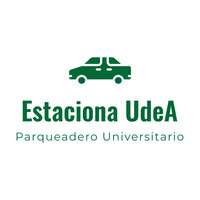

# Estaciona UdeA

## Descripción General del Proyecto

**Estaciona UdeA** es un software de consola desarrollado en Python para la gestión eficiente del parqueadero del sector universitario de la Universidad de Antioquia.  
Este sistema está orientado a facilitar el registro de usuarios, el control de ingreso y salida de vehículos, el cálculo automatizado del cobro por uso, la generación de reportes administrativos y la exportación de datos para su análisis posterior.

Nuestro objetivo es optimizar los procesos operativos, reducir errores humanos y modernizar la administración del parqueadero, asegurando una experiencia más ágil y ordenada para los trabajadores y usuarios.

---

## Equipo Desarrollador

### Sebastián Cortés Sánchez
- **Programa:** Ingeniería Industrial – Universidad de Antioquia  
- **Rol en el proyecto:** Líder del equipo  
- **Fortalezas:** Pensamiento lógico, análisis de datos, estructuración de código  
- **Responsabilidades:** Coordinación general, diseño del menú principal, exportación de datos, documentación del repositorio

### Harol González Sepúlveda
- **Programa:** Ingeniería Industrial – Universidad de Antioquia  
- **Rol en el proyecto:** Desarrollador  
- **Fortalezas:** Validación de datos, uso de condicionales, manejo de estructuras de datos  
- **Responsabilidades:** Registro de usuarios y vehículos, validación de entradas, gestión de espacios de parqueo
